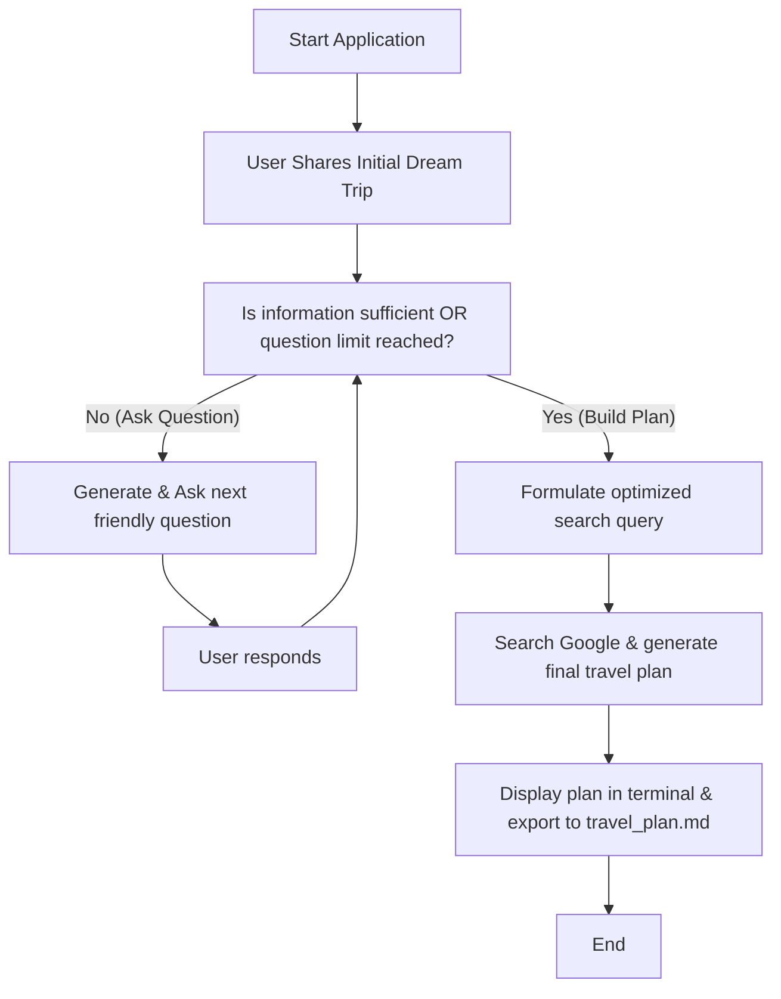

# 🌴 example-ai-agent: AI Vacation Planner

Welcome to **example-ai-agent**, a simple, premium terminal-based AI Travel Agent built with the official modern Google GenAI SDK. 

This agent guides users through an interactive, personalized interview of **at most 3 clarifying questions** to learn about their vacation preferences, budget, interests, and style. It then utilizes **Google Search grounding** to fetch live information and compile a complete travel itinerary customized for them.

---

## ✨ Features
- **Structured Interview Phase**: Uses Gemini's **Structured Outputs** (via Pydantic models) to intelligently decide when it has enough info to recommend, or dynamically formulate the next question (max 3).
- **Google Search Grounding**: Leverages Gemini's native Google Search capabilities to find real-world, up-to-date destinations, activities, and hotels.
- **Rich Terminal UI**: Beautiful ANSI-styled interface that behaves like a professional human travel agent.
- **Exportable Travel Plans**: Automatically saves the final tailored travel plan along with Google Search citation links to `travel_plan.md` for easy access.

---

## 🛠️ Architecture

The agent operates in two main phases:



---

## 🚀 Getting Started

### 📋 Prerequisites
Ensure you have Python 3.10+ installed.

### 📦 Installation
1. Clone this repository (if not already done):
   ```bash
   git clone https://github.com/tonisheesmith13/example-ai-agent.git
   cd example-ai-agent
   ```

2. Create and activate a virtual environment:
   ```bash
   python3 -m venv .venv
   source .venv/bin/activate
   ```

3. Install the dependencies:
   ```bash
   pip install -r requirements.txt
   ```

4. Set up your Gemini API Key:
   ```bash
   export GEMINI_API_KEY="your-api-key-here"
   ```
   *(The script will also automatically attempt to read the key from `/home/tonisheesmith/gemini_key.txt` if available in your current environment).*

---

## 🎮 Running the Agent

Start the interactive session directly from your terminal:
```bash
./travel_agent.py
```
or 
```bash
python3 travel_agent.py
```

Follow the prompts and enjoy designing your dream vacation!

---

## 📄 Output Details
At the end of your session, the agent creates a custom **`travel_plan.md`** file that contains:
1. **Destination**: A single, custom recommendation explaining why it suits you.
2. **Top 3 Recommended Activities**: Selected attractions with short descriptions and practical tips.
3. **Hotel / Stay Options**: At least two specific recommendations spanning different styles and price points.
4. **Google Search Sources**: Transparent clickable citation links verifying the real-world options.